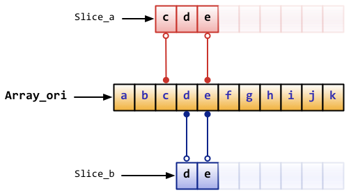
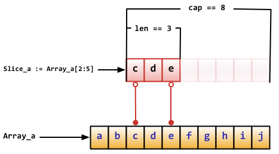
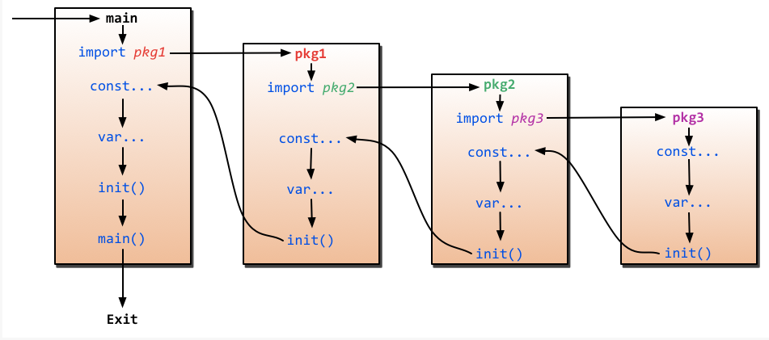

# Basic concepts #
1. Go是一种新的语言，一种并发的、带垃圾收集的、快速编译的语言。
2. 特点：
    - Go是静态类型的语言，它的类型系统没有层级。因此用户不需要在定义类型之间的关系上花费时间
    - Go完全是垃圾回收型的语言，并为并发执行与通信提供了基本的支持
    - Go是一种编译型语言
3. Go command
    - go build: go build会忽略目录下以"_"或"."开头的go文件
    - go clean: 移除当前源码包里面编译生成的文件
    - go get: 动态获取远程代码包的，目前支持BitBucket、Github、Google Code和Launchpad
    - go install: 这个命令在内部实际上分成了两步操作：第一步是生成结果文件(可执行文件或者.a包)，第二步会把编译好的结果移到$GOPATH/pkg或者$GOPATH/bin
    - go test: 自动读取源码目录下面名为*_test.go文件，生成并运行测试用的可执行文件。
    - godoc: 查看builtin包：godoc builtin; 查看http包：godoc net/http; 查看某个包里面的函数：godoc fmt Printf; 查看相应的代码：godoc -src fmt Printf; 执行godoc -http=:port
4. Go使用package（和Python的模块类似）来组织代码。main.main()函数(这个函数主要位于主包）是每一个独立的可运行程序的入口点。Go使用UTF-8字符串和标识符(因为UTF-8的发明者也就是Go的发明者)，所以它天生就具有多语言的支持。

# slice #
1. slice不是真正意义上的动态数组，而是一个引用类型。slice总是指向一个底层array,slice的声明也可以像array一样，只是不需要长度。
    - var fslic []int;
    - slice := []byte{'a', 'b', 'c', 'd'};
2. 
3. 
4. append函数会改变slice所引用的数组的内容，从而影响到引用同一数组的其它slice。 但
5. 当slice中没有剩余空间（即(cap-len) == 0）时，此时将** 动态分配新的数组空间。返回的slice数组指针将指向这个空间，而原数组的内容将保持不变;  **其它引用此数组的slice则不受影响。

# map #
1. map的读取和设置也和slice一样，通过key来操作，只是slice的index只能是int类型，而map多了很多类型，可以是int,可以是string及所有完全定义了==与!=操作的类型。
2. 声明map
    - var numbers map[string]int; key为string,value为int
    - numbers := make(map[string]int); 同上
3. map是** 无序 **的，每次打印出来的map都会不一样，他不能通过Index获取，而必须通过key获取。
4. map的长度是不固定的，也是一种** 引用类型 **。
5. map内置有判断是否存在key的方式。
                rating := map[string]float32{"C":5, "Go":4, "Python":3, "C++":2};
                //map有两个返回值，第二个返回值如果不存在key，那么ok为false
                csharpRating, ok := rating["csharp"];
                if ok {
                    fmt.Println("C# is in the map and its rating is", csharpRating);
                } else {
                    fmt.Println("we have no rating associated with C# in the map");
                }

                delete(rating, "C");
6. ** map是一种引用类型 **，如果两个map同时指向一个底层，那么一个改变，另一个也相应的改变。
                m := make(map[string]int);
                m["hello"] = 34;
                m1 := m;
                m1["hello"] = 38;//此时m["hello"]也为38

# make、new操作 #
1. make用于内建类型(map、slice和channel)的内存分配。new用于各种类型的内存分配。
2. 内建函数new本质上说跟其它语言中的同名函数功能一样：new(T)分配了** 零值填充的T类型的内存空间 **，并且返回其地址，即一个*T类型的值。用GO的术语，** new返回一个指针，指向新分配的类型T的零值 **。
3. 内建函数make(T, args)与new(T)有着不同的功能，make** 只能 **创建slice、map和channel，并且返回一个有初始值(非零)的T类型，而不是*T。本质来讲，导致这三个类型有所不同的原因是指向数据结构的引用在使用前必须被初始化。例如，一个slice，是一个包含指向数据结构(内建array)的指针、长度和容量的三项描述符；在这些项目被创建初始化之前，slice为nil。对于slice、map和channel来说，make初始化了内部的数据结构，填充适当的值。** make返回初始化后的(非零)值 **

# panic，recover #
1. Go没有像java那样的异常机制，它不能抛出异常，而是使用了panic和recover机制。**一定要记住，你应当把它们作为最后的手段来使用**，也就是说，你的代码中应当没有，或者很少有panic的东西。这是个强大的工具，请明智地使用它。
2. panic是一个内建函数，可以中断原有的控制流程，进入一个令人恐慌的流程中。当函数F调用panic，函数F的执行被中断，但是F中的延迟函数会正常执行，然后F返回到调用它的地方。在调用的地方，F的行为就像调用了panic。这一过程继续向上，知道发生panic的goroutine中所有调用的函数返回，此时程序退出。
3. 恐慌可以直接调用panic产生，也可以由运行时错误产生，例如访问越界的数组。
4. recover是一个内建的函数，可以让进入令人恐慌的流程中的goroutine恢复过来。**recover仅在延迟函数中有效**。在正常的执行过程中，调用recover回返回nil，并且没有其它的任何效果。如果当前的goroutine陷入恐慌，调用recover可以捕获到panic的输入值，并且恢复正常的执行。
5. 调用f,出现了panic，则执行延迟函数，如果在延迟函数中有recover处理，则程序不会崩溃，此时f下面的指令不会被执行
```go
       package main
       import (
           "fmt"
           "os"
       )
       func init_1() {
           var user = os.Getenv("USER1")
           if user == "" {
               panic("no value for $USER")
           }
       }
       func g() {
           fmt.Println("g was invoked")
       }
       func throwPanic(f func()) bool {
           var result bool = true
           defer func() {
               if x := recover(); x != nil {
                   result = true
               } else {
                   result = false
               }
           }()
           // if f()产生了panic
           //       if 有recover
           //           程序不会崩溃，f下面的代码不会被执行，直接返回
           //       else
           //           程序崩溃
           // else
           //       顺序执行
           f()
           g()
           if result {
               fmt.Println("panic and recover invoked!")
           } else {
               fmt.Println("panic and recover not invoked")
           }
           fmt.Println("haha")
               return result
           }
           func main() {
               fmt.Println(throwPanic(init_1))
               fmt.Println("======================")
           }

```
# main函数和init函数 #
1. Go里面有两个保留的函数：init函数(能够应用于所有的package)和main函数(只能应用于package main)。这两个函数在定义时**不能有任何的参数和返回值**。虽然一个package里面可以写任意多个init函数，但这无论是对于可读性还是以后的可维护性来说，我们都强烈建议用户在一个package中每个文件只写一个init函数。
2. Go程序会自动调用init()和main()，所以你不需要在任何地方调用这两个函数。每个package中的init函数都是可选的，但package main就必须包含一个main函数。
3. 程序的初始化和执行都起始于main包。如果main包还导入了其它的包，那么就会在编译时将它们依次导入。有时一个包会被多个包导入，那么它只会被导入一次.当一个包被导入时，如果该包还导入了其他的包，那么会先将其他的包导入进来，然后再对这些包中的包级常量和变量进行初始化，接着执行init函数(如果有的话)，一次类推。等所有被导入的包都被加载完毕了，就会开始对main包中的包级常量和变量进行初始化，然后执行main包中的init函数,最后执行main函数。
# OO #
1. A method is a function with an implicit first argument, called a **receiver**
2. method的语法如下： func (r ReceiverType) function_name(arguments) (results) {}
3. method可以被定义到任何你自定义的类型，内置类型，struct等各种类型上面。
4. 如果一个method的receiver是*T，你可以在一个T类型的实例变量V上面调用这个method，而不需要&V去调用这个method; 如果一个method的receiver是T，你可以在一个*T类型的变量P上面调用这个method，而不需要*P去调用这个method。
5. go语言不支持重载
# interface #
1. interface是一组method的集合。我们可以通过interface定义对象的一组行为。
2. interface类型定义了一组方法，如果某个对象实现了某个接口的**所有方法**，则称此对象实现了此接口。
3. interface可以被任意的对象实现，一个对象可以实现任意多个interface。
4. 任意的类型都实现了空interface，也就是包含0个method的interface。
5. 如果我们定义了一个interface的变量，那么这个变量里面可以存实现了这个interface的任意类型的对象。
6. Go has method tables but computes them at run time.
# goroutine #
1. goroutine是Go并行设计的核心。goroutine说到底其实就是线程，但是它比线程更小，十几个goroutine可能体现在底层就是五六个线程，Go语言内部帮你实现了这些goroutine之间的内存共享。执行goroutine只需极少的栈内存(大概是4～5kB)，当然会根据相应的数据伸缩。也正是因为如此，可同时运行成千上万个并发任务。goroutine比thread更易用,更高效，更轻便。
2. goroutine是通过Go的runtime管理的一个线程管理器。goroutine通过go关键字实现，其实就是一个普通的函数。如 go hello(a, b, c)
3. 不要通过共享来通信，而要通过通信来共享。
4. goroutine运行在相同的地址空间，因此访问共享内存必须做好同步。那么goroutine之间如何进行数据的通信呢，Go提供了一个很好的通信机制channel。channel可以与Unix shell中的双向管道作类比：可以通过它发送或者接收值。这些值只能是特定的类型：channel类型。**定义一个channel时，也需要定义发送到channel的值类型。**注意，必须使用make创建channel：
```Go
        ci := make(chan int)
        cs := make(chan string)
        cf := make(chan interface{})
```
5. channel通过操作符<-来接收和发送数据。
```
        ch <- v //发送v到channel ch
        v := <-ch //从ch中接收数据，并赋值给v
```
6. select可以监听channel上的数据流动。select默认是阻塞的，只有当监听的channel中有发送或者接收可以进行时才会运行，当多个channel都准备好的时候，select是随机的选择一个执行的。
# Concurrency and parallel #
1. Go support for concurrency
    - goroutine: concurrent execution
    - channel: synchronization and messaging
    - select: multi-way concurrent control
2. 接收者阻塞到有数据可以接收。如果信道是非缓冲的，发送者阻塞到接收者收到其值。如果信道有缓冲，发送者只需阻塞到值拷贝到缓冲里；如果缓冲满，则等待知道某个接收者取走一值。

# Reference #
1. [本文的内容](http://blog.5d13.cn/resources/goweb/preface.html)
2. [Go的内存模型](http://blog.5d13.cn/resources/goweb/preface.html)
3. [Effective Go](http://golang.org/doc/effective_go.html#slices)
4. [Effective Go](https://golang-china.googlecode.com/svn/trunk/Chinese/golang.org/index.html#toc68)
