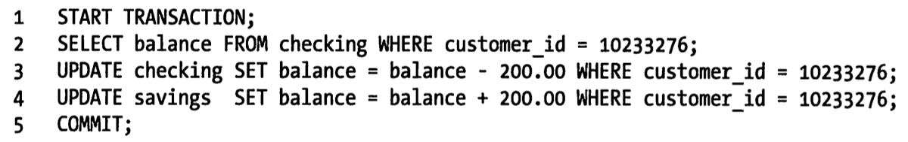

# install mysql #
1. [download](http://dev.mysql.com/downloads/mysql/)
2. 解压mysql.tar.gz文件
2. sudo groupadd mysql
3. sudo useradd -r -g mysql mysql: 创建mysql用户只是未来我控制文件所有权的目的，因此添加-r
4. 假设解压到了~/opt/mysql/下面:将mysql的所有者改为mysql: sudo chown -R mysql:mysql ~/opt/mysql/
5. 使用mysql_install_db初始化授权表。此操作只是在mysql初次安装时才需要执行，如果是已存在的安装，则可以跳过此步骤，否则会覆盖先前的授权信息。sudo scripts/mysql_install_db --user=mysql
6. 配置mysql服务，然后启动
    cd /etc/init.d/
    sudo ln -s ~/opt/mysql/support-files/mysql.server
    sudo /etc/init.d/mysql.server start
7. 
# 基本操作 #
1. 登录数据库: mysql -h hostname -u username -p
2. CREATE DATABASE dbname;
3. CREATE TABLE tablename;
4. SHOW DATABASE;//显示数据库信息，有哪些可用的数据库
5. USE dbname;
6. SHOW TABLES; //显示表信息，有哪些可用的表
7. DESC tablename; //显示创建表的信息
# 备份 #
1. 将数据库mydb导出到mydb.sql中，包括数据
    mysqldump -h hostname -u root -p mydb > mydb.sql
2. 将数据库mydb中的mytable表导出到mytable.sql中，包括数据
    mysqldump -h hostname -u root -p mydb mytable > mytable.sql
3. 将数据库mydb的结构导出到mydb_stru.sql文件中:
    mysqldump -h hostname -u root -p mydb --add-drop-table > mydb_stru.sql
4. 同时备份多个mysql数据库
    mysqldump -h hostname -u root -p --databases databasename1 databasename2 databasename3 > multtibackup.sql
5. 备份所有的数据
    mysqldump -h hostname -u root -p --all-databases > allbackup.sql;

# 还原 #
1. 创建数据库mydb2, CREATE DATABASE mydb2
2. mysql -h hostname -u root -p mydb2 < mydb2.sql

# 导入文件大小的限制 #
1. 默认情况下，mysql导入文件的大小是有限制的，最大为2M
2. 影响Mysql导入文件大小的参数有三个：memory_limit=128M,upload_max_filesize=2M,post_max_size=8M

# 将一个数据库(student_db)中的表(student)和另一个数据库(student_db02)中的student，合并，规则是：相同的Key，将value相加，不同的key，将student_db02中的数据合并到student_db中
    1. 相同的value相加：
        update student_db.student
        inner join student_db02.student on student_db.student.id=student_db02.student.id
        set student_db.student.math=student_db.student.math+student_db02.student.math;
    2. 不同的key插入：
        insert into student_db.student
        select student_db02.student.id student_db02.student.name from student_db02.student where not exits
        (
            select * from student_db.student where student_db.student.id=student_db02.student.id
        )

# select语句的执行顺序 #
1. select语句的基本语法：
```
        SELECT  selection_list      # what columns to select
        FROM    table list          # which tables to select rows from
        WHERE   primary_constraint  # what conditions rows must satisfy
        GROUP BY grouping_columns   # How to group results
        HAVING secondary_contraint  # Secondary conditions rows must satisfy
        ORDER BY sorting_columns    # How to sort results
        LIMIT from, count;          # Limit row count on results
```
2. SQL select语句完整的执行顺序
```
        1. from子句组装来自不同数据源的数据
        2. where子句基于指定的条件对记录进行筛选
        3. group by子句将数据划分为多个分组
        4. 使用聚集函数进行计算
        5. 使用having子句筛选分组
        6. 计算所有的表达式
        7. 使用order by对结果进行排序
```


# mysql优化 #
## 垂直分割 ##
1. "垂直分割"是一种把数据库中的表按列变成几张表的方法，这样可以降低表的复杂度和字段的数目，从而达到优化的目的。
2. 实例一：在Users表中有一个字段是家庭地址，这个字段是可选字段，相比起，而且你在数据库操作的时候除了个人信息外，你并**不需要经常读取或是改写这个字段**。那么，为什么不把他放到另外一张表中呢？ 这样会让你的表有更好的性能.
3. 示例二： 你有一个叫 “last_loginn” 的字段，它会在每次用户登录时被更新。但是，每次更新时会导致该表的查询缓存被清空。所以，你可以把这个字段放到另一个表中，这样就不会影响你对用户ID，用户名，用户角色的不停地读取了，因为查询缓存会帮你增加很多性能。
4. 你需要注意的是，这些被分出去的字段所形成的表，你不会经常性地去Join他们，不然的话，这样的性能会比不分割时还要差，而且，会是极数级的下降。
## 拆分大的Delete或者insert ##
1. ** 这两个操作是会锁表的，表一锁住了，别的操作都进不来 **
2. ** 如果你有一个大的处理，你定你一定把其拆分，使用 LIMIT 条件是一个好的方法。 **
```
    while (1) {
        //每次只做1000条
        mysql_query("DELETE FROM logs WHERE log_date <= '2009-11-01' LIMIT 1000");
        if (mysql_affected_rows() == 0) {
            // 没得可删了，退出！
           break;
        }
        // 每次都要休息一会儿
        usleep(50000);
    }
```
## 选择正确的存储引擎 ##
1. [MySQL: InnoDB 还是 MyISAM](http://coolshell.cn/articles/652.html)
2. MyISAM 适合于一些需要大量查询的应用，但其对于有大量写操作并不是很好。甚至你只是需要update一个字段，整个表都会被锁起来，而别的进程，就算是读进程都无法操作直到读操作完成。另外，MyISAM 对于 SELECT COUNT(*) 这类的计算是超快无比的。
3. InnoDB 的趋势会是一个非常复杂的存储引擎，对于一些小的应用，它会比 MyISAM 还慢。他是它支持“行锁” ，于是在写操作比较多的时候，会更优秀。并且，他还支持更多的高级应用，比如：事务。
4. MyISAM索引是通过数据的物理位置引用被索引的，而InnoDB是通过主键引用被索引的行;[两种索引的区别](http://www.2cto.com/database/201211/172380.html)
5. MyISAM的数据分布非常简单，MyISAM按照数据插入的顺序存储在磁盘上。
6. InnoDB在二级索引上使用共享(读)锁，但访问主键索引需要排他(写)锁。


# 事务 #
## ACID ##
1. ACID： 原子性(atomicity), 一致性(consistency), 隔离性(isolation)，持久性(durability)
2. 
3. 原子性：一个事物必须被视为一个不可分割的最小工作单元，整个事物中的所有操作要么全部提交成功，要么全部失败回滚，对于一个事物来说，不可能只执行其中的一部分操作，这就是原子性。
4. 一致性：数据库总是从一个一致性状态转换到另一个一致性状态。在银行转账的例子中，一致性确保了，即使在执行第三，四条语句之间系统崩溃了，支票账户也不会损失200美金，因为事物最终没有被提交，所以事物所做的修改也不会保存到数据库中。
5. 隔离性：一个事物所做的修改在最终被提交之前，对其他事物是不可见的。在前面的例子中，当执行完第三条语句但是还没有执行第四条语句时，此时有另外一个账户汇总程序开始执行，则其看到的支票账户余额并没有被减去200.当然这涉及到隔离级别。
6. 持久性：一旦事物被提交，其所做的修改就会永久保存到数据库中。此时即使系统崩溃，修改的数据也不会丢失。
## 隔离级别 ##
1. READ UNCOMMITTED(未提交读)：在READ UNCOMMITTED级别，事物中的修改，即使没有提交，对其他事物也都是可见的。事物可以读取未提交的数据，这也被成为脏读(Dirty read)。这个级别会导致很多问题，从性能上来说，READ UNCOMMITTED不会比其他的级别好太多，但却缺乏其他级别的很多好处，除非真的有非常必要的理由，在实际应用中一般很少使用。
2. READ COMMITTED(提交读)：大多数数据库系统的默认级别都是READ COMMITTED（但Mysql不是）。READ COMMITTED满足前面提到的隔离级别的简单定义：一个食物开始时，只能“看见”已经提交的事物所做的修改。换句话说，**一个事物从开始直到提交之前，所做的任何修改对其他事物都是不可见的。**这个级别有时候也叫做不可重复读，因为两次执行同样的查询，可能会得到不一样的结果。
3. REPEATABLE READ(可重复读)：REPEATABLE READ解决了脏读的问题。该级别保证了在同一个事物中多次读取同样的记录的结果是一致的。但是理论上，可重复读隔离级别还是无法解决另外一个幻读(Phantom Read)的问题。所谓幻读，指的是当某个事物在读取某个范围内的记录时，另外一个事物又在该范围内插入了新的记录，当之前的事物再次读取该范围的记录时，会产生幻行。InnoDB存储引擎通过多版本并发控制(MVCC, Multiversion Concurrency Control)解决了幻读的问题。
4. SERIALIZABLE（可串行化）：SERIALIZABLE是最高的隔离级别。他通过强制事物串行化执行，避免了前面所说的幻读的问题。简单来说，SERIALIZABLE会在读取的每一行数据上都加锁，所以可能导致大量的超时和锁争用的问题。实际应用中也很少用到这个隔离级别，只有在非常需要确保数据的一致性而且可以接受没有并发的情况下，才考虑采用该级别。
5. 


# 索引 #
## 基本知识 ##
1. 索引可以包含一个或多个列的值。如果索引包含多个列，那么列的顺序也十分重要，因为Mysql只能高效地使用索引的最左前缀列。创建一个包含两个列的索引，和创建两个只包含一列的索引是大不相同的。
2. MySQL的唯一限制和主键限制都是通过索引实现的。
## 索引的类型 ##
### B-Tree ###
1. 索引是在存储引擎层而不是服务器层实现的。
2. B-Tree索引: 更多的是使用B+Tree索引。B-Tree索引能够加快访问数据的速度，因为存储引擎不再需要进行全表扫描来获取需要的数据，取而代之的是从索引的根节点开始进行搜索。
3. B-Tree索引的限制：
    - 如果不是按照索引的最左列开始查找，则无法使用索引。
    - 不能跳过索引中的列。
    - 如果查询中有某个列的范围查询，则其右边所有列都无法使用索引优化查询。例如有查询WHERE last_name='Smith' AND first_name LIKE 'J%' AND dob = '1976-12-23'，这个查询只能使用索引的前两列，因为这里LIKE是一个范围条件，所以dob不能用于索引查询。
4. 索引的顺序非常重要，这些限制都和索引列的顺序有关。在优化性能的时候，可能需要使用相同的列但顺序不同的索引来满足不同类型的查询需求。
### hash索引 ###
1. 哈希索引基于哈希表实现，只有精确匹配索引所有列的查询才有效。对每一行数据，存储引擎都会对所有的索引列计算一个hash码。hash索引将所有的hash码存储在索引中，同时在哈希表中保存指向每个数据行的指针。
2. 只有memory引擎显式支持哈希索引。memory引擎表的默认索引类型就是hash索引，同时支持B-Tree索引。

## 使用索引的策略 ##
1. 确保所有主键列被索引(大部分服务器会在创建主键约束时自动生成唯一索引)。针对多列主键，考虑为主键列的子集构建附加索引，或者以与主键约束定义不同的顺序为所有主键列另外生成索引。
2. 为所有被外键约束引用的列创建索引。服务器在准备删除父行时会查找以确保没有子行存在，为此它必须发出一个子查询搜索列中的特定值，如果该列没有索引，那么服务器必须扫描整个表。
3. 索引那些被频繁检索的列。除了短字符串列，大多数日期列也是不错的候选。
## 索引的优点 ##
1. 最常见的B-Tree索引，按照顺序存储数据，所以Mysql可以用来做Order by和group by操作。因为数据是有序的，所以B-tree也就会将相关的列值都存储在一起。最后，因为索引中存储了实际的列值，所以某些查询只使用索引就能够完成全部查询。
2. 索引的优点：
    - 索引大大减少了服务器需要扫描的数据量
    - 索引可以帮助服务器避免排序和临时表
    - 索引可以将随机I/O变为顺序I/O

## 聚族索引 ##
1. 聚族索引不是一种单独的索引类型，而是一种数据存储方式。InnoDB的聚族索引实际上在同一个结构中保存了**B-Tree索引和数据行**。
2. 但表有聚族索引时，它的数据行实际上存放在索引的叶子页中。术语"聚族"表示数据行和相邻的键值紧凑地存储在一起。因为无法把数据行存放在两个不同的地方，所以一个表中只能有一个聚族索引。
3. 聚族主键可能对性能有帮助，但也可能导致严重的性能问题。所以需要仔细地考虑聚族索引，尤其是将表的存储引擎从InnoDB改成其他引擎的时候。

## 覆盖索引 ##
1. Mysql可以使用索引来直接获取列的数据，这样就不再需要读取数据行。
1. 如果一个索引包含(或者说覆盖)所有需要查询的字段的值，我们就称之为“覆盖索引”。这样就没有必要在进行回表查询了。
2. 由于InnoDB的聚簇索引，覆盖索引对InnoDB表特别有用。InnoDB的二级索引在叶子节点中保存了行的主键值，所以如果二级主键能够覆盖查询，则可以避免对主键索引的二次查询。

## limit与order by的优化 ##
1. limit的原理：以limit M,N为基础:limit首先要查找M+N行，然后从N行处，取M行。如limit 10000,20的意思是扫描满足条件的10020行(可能会涉及到磁盘操作)，返回最后的20行，这需要扫描10020行，在一个高并发的应用里，每次查询需要扫描超过1w行，性能可能大打折扣。limit N的性能是没什么问题的.
2. 解决方案：
    - 限制用户能够翻页的数量
    - 使用延迟关联：如原来的sql语句: SELECT <cols> FROM profiles WHERE sex='M' ORDER BY rating LIMIT 1000000, 10;现在通过覆盖索引查询返回需要的主键(profiles以sex和rating为索引),再根据这些主键关联原表获得需要的行：
```
        SELECT <cols> FROM profiles INNER JOIN (
            SELECT <primary key cols> FROM profiles
            WHERE x.sex='M' ORDER BY rating LIMIT 1000000,10
        ) AS x ON profiles.<primary Key cols> = x.<primary key cols>
        具体的例子：
            SELECT * FROM table LIMIT 1000000,10 ORDER BY postdate;
        or
            SELECT * FROM table where vid >= (SELECT vid FROM table ORDER BY postdate LIMIT 1000000,1) LIMIT 10;
```
3. 引用
    - [reference1](http://www.fuchaoqun.com/2009/04/efficient-pagination-using-mysql/)
    - [reference2](http://www.cnblogs.com/adforce/archive/2012/06/02/2532253.html)
    - [reference3](http://www.mysqlsupport.cn/optimize_limit_sql/)

# mysql c API #
1. you may also see libraries that include _r in the names. Before MySQL 5.5, these were built as thread-safe (re-entrant) libraries separately from the non-_r libraries. As of 5.5, both libraries are the same and the _r names are symbolic links to the corresponding non-_r names. There is no need to use the _r libraries.
2. 

## 其他 ##
1. mysql不允许对同一张表同时进行查询和更新。
