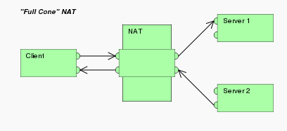
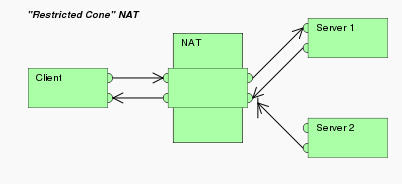
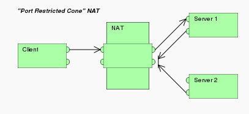
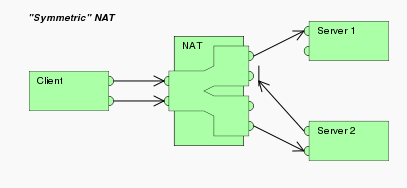

# NAT(Network Address Translation) #
1. NAT是一种在IP封包通过** 路由器 **或** 防火墙 **时重写源IP地址或目的IP地址的技术。这种技术被普遍使用在有多台主机但只有通过一个共有IP地址访问因特网的私有网络中。
2. NAT的类型
 - ** Full cone NAT(完全受限的锥形NAT) **:一旦一个内部地址(iAddr:port1)映射到外部地址(eAddr:port2)，所有发自iAddr:port1的包都经由eAddr:port2向外发送。任意外部主机都能通过给eAddr:port2发包到达iAddr:port1。
 - ** Address-Restricted cone NAT(地址受限的锥形NAT) **: 一旦一个内部地址(iAddr:port1)映射到外部地址(eAddr:port2)，所有发自iAddr:port1的包都经由eAddr:port2向外发送。任意外部主机(hostAddr:any)都能通过给eAddr:port2发包到达iAddr:port1的前提是: iAddr:port1之前发送过包到hostAddr:any。"any"也就是说端口不受限制。
 - ** Port-Restricted cone NAT(端口受限的锥形NAT) **: 类似受限制锥形NAT，但是还有端口限制。一旦一个内部地址(iAddr:port1)映射到外部地址(eAddr:port2)，所有发自iAddr:port1的包都经由eAddr:port2向外发送。一个外部主机(hostAddr:port3)能够发包到iAddr:port1的前提是：iAddr:port1之前发送过包到hostAddr:port3。
 - ** Symmetric NAT(对称NAT) **: 每一个来自相同内部IP与端口，到一个特定目的地地址和端口的请求，都映射到一个独特的外部IP地址和端口。同一个内部IP与端口发到不同的目的地和端口的信息包，都使用不同的映射。** 只有曾经收到过内部主机封包的外部主机，才能够把封包发回 **。
