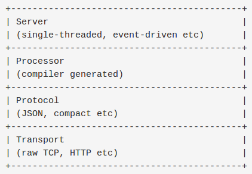

# Basic Concept #
## Types ##
1. Thrift类型系统包括预定义基本类型，用户自定义结构，容器类型，异常和服务定义。
    1). **基本类型**
    - bool: bool类型，占一个字节
    - byte: 有符号字节
    - i16:  16位有符号整形
    - i32:  32位有符号整形
    - i64:  64位有符号整形
    - double:64位浮点数
    - string:未知编码或者二进制的字符串
    - Thrift不支持无符号整形，因为很多目标语言不存在无符号整形
    2). **容器类型**
    - list<t1>: 一系列t1类型的元素组成的有序表
    - set<t1>:  一系列t1类型的元素组成的无序表，元素唯一
    - map<t1, t2>
    - 容器中的元素类型可以是除了service之外的任何合法thrift类型(包括结构体和异常).
    3). **结构体和异常**
    - 异常使用关键字exception
    - 结构体使用关键字struct
    4). **service**
    - 服务的定义方法在语法上等同于面向对象语言中定义的接口,thrift编译器会产生实现这些接口的client和server桩
    5) **类型定义**
    - typedef i32 MyInteger
    - typedef Tweet ReTweet
    - 末尾没有分号
    - struct也可以使用typedef
2. oneway标识符表示client发出请求后不必等待回复(非阻塞)直接进行下面的操作.
3. 结构体不支持继承，而service支持继承.
4. Thrift Network stack
    - 
5. Server的作用
    - 创建一个transport对象
    - 为transport对象创建输入输出ptotocol
    - 基于输入输出protocol创建processor
    - 等待连接请求并将之交给processor处理
# 支持的数据传输格式，数据传输方式和服务模型 #
1. 支持的传输格式
    - TBinaryProtocol : 二进制格式
    - TCompactProtocol: 压缩格式
    - TJSONProtocol:  : JSON格式
    - TSimpleJSONProtocol: json只写协议
    - TDebugProtocol: 使用易懂的可读的文本格式
2. 支持的数据传输方式
    - TSocket: 阻塞式socket
    - TFramedTransport: 以frame为单位进行传输，非阻塞服务中使用
    - TFileTransport: 以文件形式进行传输
    - TMemoryTransport: 将内存用于I/O
    - TZlibTransport: 使用zlib进行压缩，与其他传输方式联合使用
3. 支持的服务模型
    - TSimpleServer: 简单的单线程服务模型，常用于测试
    - TThreadPoolServer: 多线程服务模型，使用标准的阻塞式IO
    - TNonblockingServer: 多线程服务模型，使用非阻塞式IO
4. Thrift文件与生成的代码对应关系
    - 每个thrift文件会产生四个文件，分别是: ${thrift_name}_constants.h, ${thrift_name}_constants.cpp, ${thrift_name}_types.h, ${thrift_name}_types.cpp
    - 对于含有service的thrift文件，会额外生成两个文件，分别为: ${service_name}.h, ${service_name}.cpp
    - 对于含有service的thrift文件，会生成一个可用的server桩：${service_name}._server.skeleton.cpp

